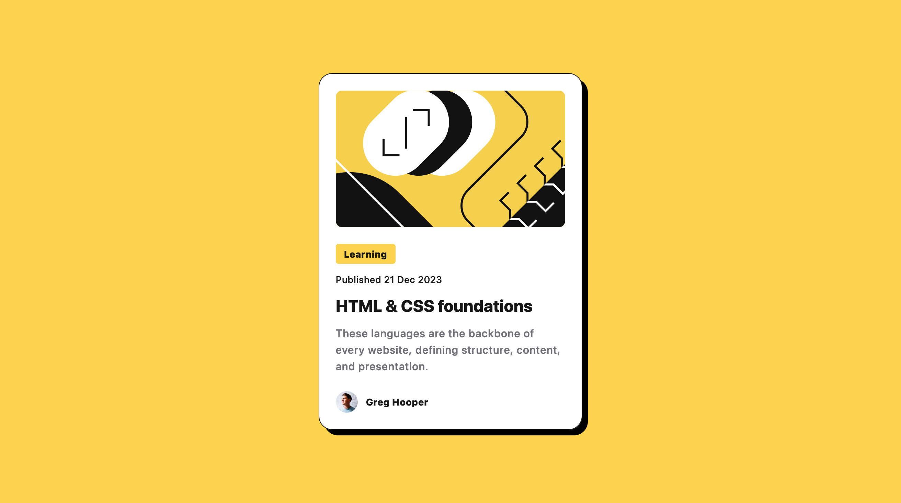

# Frontend Mentor - Blog preview card solution

This is a solution to the [Blog preview card challenge on Frontend Mentor](https://www.frontendmentor.io/challenges/blog-preview-card-ckPaj01IcS). Frontend Mentor challenges help you improve your coding skills by building realistic projects.

## Table of contents

- [Overview](#overview)
  - [The challenge](#the-challenge)
  - [Screenshot](#screenshot)
  - [Links](#links)
- [My process](#my-process)
  - [Built with](#built-with)
  - [What I learned](#what-i-learned)
  - [Continued development](#continued-development)
  - [Useful resources](#useful-resources)
- [Author](#author)

## Overview

### The challenge

Users should be able to:

- See hover and focus states for all interactive elements on the page

### Screenshot

### Links

- Live Site URL: [Add live site URL here](https://fem-blog-preview-card.vercel.app/)

## Overview

### Built with

- [Vite](https://vitejs.dev/)
- [Tailwind](https://tailwindcss.com/)
- [TypeScript](https://www.typescriptlang.org/)
- [React](https://reactjs.org/)

### What I learned

It was nice to set up a fresh project and go through all the hassle of installing the custom font and figuring out how to reference it in Vite versus Next. I also hadn't create custom box-shadows with Tailwind before.

### Continued development

I look forward to spending more time with the Tailwind theming in the next project. And I may use Next, since it has a setup option for Tailwind when you build the package.

### Useful resources

- [CSS Cheatsheet](https://htmlcheatsheet.com/css/) - I just found out about this site, but I'm going to keep it around as it's a great reference.

## Author

- Website - [Robert Crocker](https://www.robcrock.com)
- Frontend Mentor - [@robcrock](https://www.frontendmentor.io/profile/robcrock)
- Twitter - [@robcrock](https://twitter.com/robcrock)
